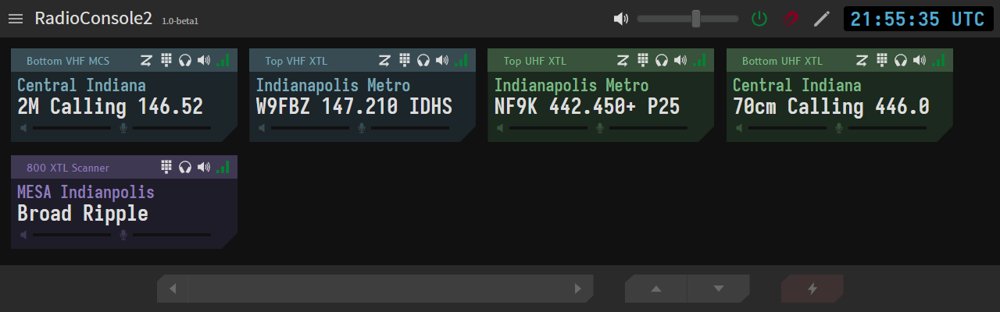
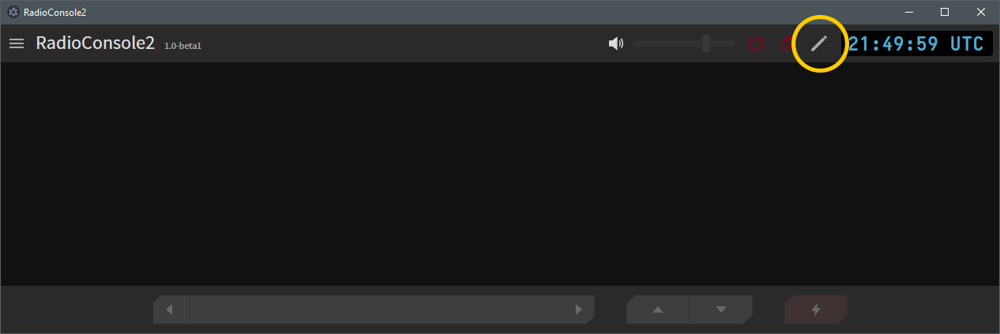
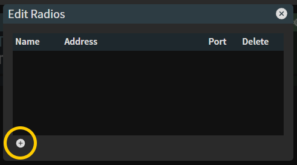
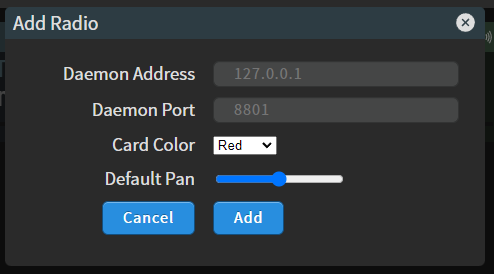
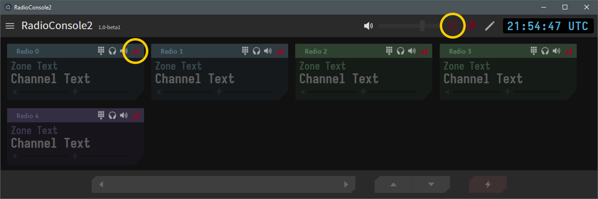

# RadioConsole2


The updated and improved python-radio-console!
## Overview
RC2 consists of two parts - the GUI console (`rc2-console`) and the radio control daemons (`rc2-daemon`), one per each radio to be connected to the console.
## Installation
### Daemon Installation
1. Download the appropriate `rc2-daemon` from the [latest release on the releases page](https://github.com/W3AXL/RadioConsole2/releases). Download the zipfile for the appropriate OS architecture you will be running the daemons on. The daemon runs as a portable executable binary and does not require an installer.
2. Install SDL2 - this is the library used for manipulating sound devices from the daemon and is not bundled by default. You will receive a runtime error if the library is not properly installed. Eventually I will figure out a better way to automate the installation of this library, but for now it has to be done manually.
   - **For Windows** - download the latest release of the [SDL2 library](https://github.com/libsdl-org/SDL) and place the `SDL2.dll` library in the same folder as your `daemon.exe`.
   - **For Linux** - install the latest version of SDL2 and libSDL2-dev from your package manager (example - `sudo apt install libsdl2-dev libsdl2-2.0-0` on Debian-based systems)
3. Test your `daemon` installation
   - Try to query your PC's audio devices by running `./daemon list-audio` from a command prompt/terminal in the directory you downloaded the daemon to. If everything is installed correctly, you should see a list of audio input & output devices printed to the terminal.
### Console GUI Installation
The `rc2-console` GUI is a portable electron application. Simply extract the exe from the [latest release on the releases page](https://github.com/W3AXL/RadioConsole2/releases) to a location of your choosing and run.
## Configuration
### Configuring the radio control `daemon`
Use the [`config.example.toml`](https://github.com/W3AXL/RadioConsole2/blob/main/daemon/config.example.toml) file as a template for your daemon configuration. See the descriptions for each section below:
#### `[info]`
These parameters are displayed in the console when you hover over a radio card.
- `name`: the name of this daemon
- `desc`: a description for this daemon
#### `[network]`
These parameters control how the daemon interacts with the network
- `ip`: the address to listen on for connections from the console. Use 0.0.0.0 to listen on all addresses.
- `port`: the port to listen on for connections from the console.
#### `[radio]`
These parameters control how the radio is configured and controlled.
-  `type`: the type of radio the daemon is connected to. Currently, only `sb9600` or `none` are supported, however in the future other radio models as well as generic CM108 interface will be implemented.
-  `rxOnly`: `true` or `false`. This is used to tell the daemon the radio it's connected to cannot transmit. Useful for things like scanners.
#### `[none]`
These options are used when the radio type is set to `none`.
- `zone`: The name of the zone to display on the console.
- `chan`: The name of the channel to display on the console.
#### `[sb9600]`
These options are used when the radio type is set to `sb9600`.
- `head`: The type of control head the SB9600 radio is using. Valid options are currently `W9` for Astro Spectra/XTL5000, or `M3` for MCS2000.
- `port`: The PC's serial port the SB9600 RIB is connected to. For windows, use the format `COMx`. For linux, use the format `/dev/ttyXXX`.
#### `[audio]`
These parameters specify which audio devices to use for TX & RX audio. Get a list of device names by running the daemon with the `list-audio` command: `./daemon list-audio`.
#### `[lookups]`
These lists control how text on the radio's display is translated to text on the console. Very handy for radios with limited display sizes like the W9 control head. They translate the lookup string in the first item to the longer text in the second. For instance, you could translate a single-line radio displaying "Z1 CHAN1" or "Z2 CHAN2" to zone text of "Zone 1"/"Zone 2" and channel text of "Channel 1"/"Channel 2" using the following `zoneLookup` and `chanLookup` entries:
```toml
[lookups]
zoneLookup = [
    ["Z1", "Zone 1"],
    ["Z2", "Zone 2"]
]
chanLookup = [
    ["CHAN1", "Channel 1"],
    ["CHAN2", "Channel 2"]
]
```
- `zoneLookup`: Lookup list used for zone text matching
- `chanLookup`: Lookup list used for channel text matching
#### `[softkeys]`
This section defines the softkeys available on the console UI, and what buttons on the radio control head map to these softkeys. At first this may seem confusing - see the Wiki entry on button bindings for more information and available options.
- `buttonBinding`: This section defines the buttons on the radio's control head and what functions are programmed to each button. 
- `softkeyList`: This section defines what softkeys are made availble on the console UI. The keys defined here map to the button bindings defined in `buttonBinding` above.
### Running the Daemon
Once your configuration file has been created, you can run the daemon using the `-c` flag to specify the config file to use. For example: `./daemon -c config.toml`. You may optionally enable logging, debug printing, and other features with additional command line switches. Run `./daemon -h` to get a full list of available command line flags.

When you run the daemon, you should see some output as the daemon connects to the radio and updates its zone/channel/status information.
### Configuring the Console UI
- First, run the rc2-console.exe file. You will be presented with an empty console window like below. Once you have your daemon(s) running as explained above, you can add new radios to the console. Click the pencil icon to bring up the edit window\
  \
  

- Use the plus (+) button to add a new radio definition. Specify the address of the PC running the daemon and the port you configured above. A new radio card will automatically be added to the main console window.\
  \
   \
   \
  In addition to the radio's address and port, you can specify the background color of the radio card and the default panning (left to right) of the radio's RX audio.

- Click the signal bars on the radio card to connect to the daemon. You can also click the power icon in the top right which will connect to all daemons currently configured.\
  \
   \
  \
  If everything goes well, you should see the bars go green and the radio text get populated from the daemon: \
  \
  
