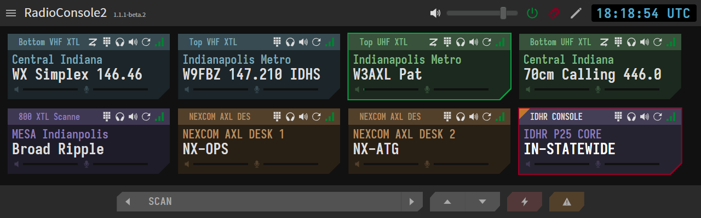
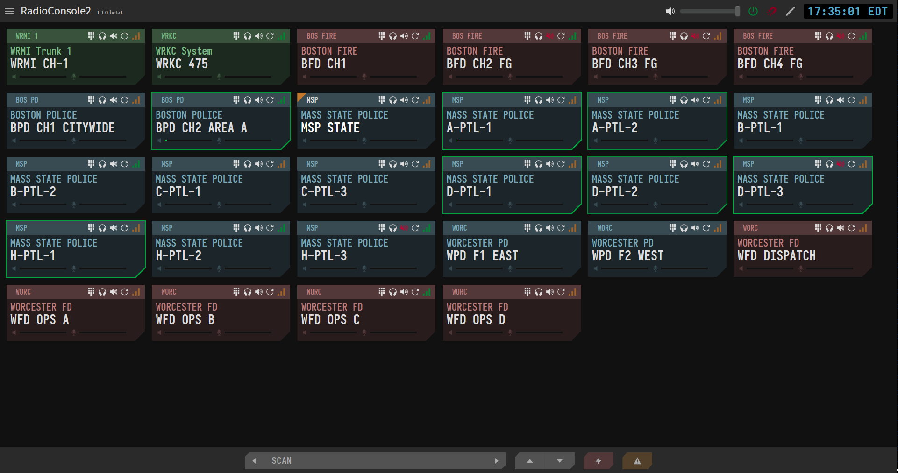

# RadioConsole2


RadioConsole2 aims to be an open-source and expandable software console for controlling radios and radio systems remotely via WebRTC.

## Overview
RC2 consists of two parts - the GUI console (`rc2-console`) and the individual radio control daemons (`rc2-daemon`), one per each radio to be connected to the console. RC2 now also supports connection to a [DVMProject FNE](https://github.com/DVMProject/dvmhost) directly using the [rc2-dvm daemon](https://github.com/W3AXL/rc2-dvm).



## Documentation

All RC2 documentation is now hosted at [ReadTheDocs](https://rc2.readthedocs.io).

## Building

### Radio Daemon

#### Prerequisites

You will need the .NET SDK in order to build the RC2 `daemon` application. Use the following page to get information on how to install the SDK:

[Install .NET on Windows, Linux, and macOS](https://learn.microsoft.com/en-us/dotnet/core/install/)

The RC2 Daemon also requires SDL2 for cross-platform audio interfacing. The repository includes SDL2 as a submodule and it can be built directly from this submodule,
assuming that you clone the repo using `--recurse-submodules`.

#### Building the Daemon

Once the .NET SDK is installed, you can build the daemon easily using the following steps:

```console
:~ $ git clone --recurse-submodules https://github.com/W3AXL/RadioConsole2.git
:~ $ cd RadioConsole2/daemon
:~ $ dotnet build
```

The `dotnet build` command should automatically install all required dependencies via NuGET and build the daemon.

### Console Client

#### Prerequisites

To build the frontend console client, you will need to install Node.JS and the PNPM package manager. Follow the instructions below
to install Node on your operating system. Ensure that you select `pnpm` as the package manager instead of the default `npm`.

[Download Node.js](https://nodejs.org/en/download)

#### Building the Console

Once Node and PNPM are installed, you can use the following steps to install all required Node dependencies and run the console in development mode

```console
:~ $ git clone --recurse-submodules https://github.com/W3AXL/RadioConsole2.git
:~ $ cd console
:~ $ pnpm install
:~ $ pnpm run start
```

Additionally, you can package the console into a single-file application using the command `pnpm run dist`. This will place a compiled
.exe or linux binary in the `output/` folder.